# AutoQA 架构设计文档

> 基于 AutoGLM + VLM 的移动端自动化测试框架

## 1. 设计目标

用自然语言描述测试流程和预期结果，框架自动完成：
1. **解析** — 将自然语言拆解为可执行步骤 + 断言条件
2. **执行** — 调用 AutoGLM 操控手机完成每一步
3. **断言** — 每步截图，用视觉模型（Qwen3-VL）判断是否符合预期
4. **容错** — 自动处理弹窗、广告等意外干扰，保持测试流程稳定
5. **报告** — 生成带截图的可视化测试报告

**示例输入：**
```
打开今日头条，点击一个文章，点击评论区。
预期：评论区顶部会出现一个发评论得红包的横幅。
```

**示例输出：** 测试通过/失败 + 每步截图 + VLM 推理过程

---

## 2. 核心理念

### 2.1 双模型分离 + 可插拔 VLM

```
┌───────────────────────────────────────────────────────────┐
│                    AutoQA 框架                              │
│                                                                 │
│   AutoGLM (手)               VLM 断言层 (眼)                     │
│   ┌───────────┐        ┌──────────────────────┐              │
│   │ 负责操作   │         │ VLMProvider 协议       │              │
│   │ Tap/Swipe │         │ ┌──────┐ ┌─────────┐ │              │
│   │ Type/Back │         │ │Qwen3  │ │ Gemini  │ │              │
│   │ (API 调用) │         │ │ -VL  │ │ 2.5 Pro │ │              │
│   └───────────┘        │ └──────┘ └─────────┘ │             │
│         │               │   可配置切换          │               │
│         │               └──────────────────────┘             │
│         ▼                    │                                 │
│   ┌─────────────────────────────┐                           │
│   │     Device 设备层            │                             │
│   │   (复用 Open-AutoGLM)       │                              │
│   └─────────────────────────────┘                           │
└───────────────────────────────────────────────────────────┘
```

这是与 Midscene 最大的区别：**Midscene 用同一个模型既操作又断言**，我们拆成两个专用模型：
- **AutoGLM** — 专门训练过手机操作，动作精准，通过 OpenAI 兼容 API 调用
- **VLM（可配置）** — 视觉理解能力强，适合做语义级断言
  - **Qwen3-VL** — 阿里通义，OpenAI 兼容 API
  - **Gemini 2.5 Pro** — Google，Gemini API

所有模型均通过 API 远程调用，不依赖本地部署。

### 2.2 复用 Open-AutoGLM 组件，而非重新实现

Open-AutoGLM 已封装了三层接口：

| 层级 | 组件 | 能力 |
|------|------|------|
| 顶层 | `PhoneAgent.run()` / `.step()` | 完整 Agent 循环 |
| 中层 | `ModelClient` / `ActionHandler` | 模型调用 + 动作执行 |
| 底层 | `DeviceFactory` (ADB/HDC) | 设备操作 |

**但 `PhoneAgent` 的顶层接口不适合测试框架：**
- `run()` — 一次跑完整个任务，无法中途插入断言
- `step()` — 只在第一轮传入任务描述，后续轮次传不了新指令，多步串联时无法注入新任务

**我们的策略：复用中底层组件（`ModelClient`、`ActionHandler`、`DeviceFactory`），自己管理对话上下文。**

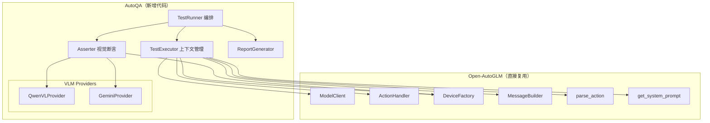

---

## 3. 分层架构

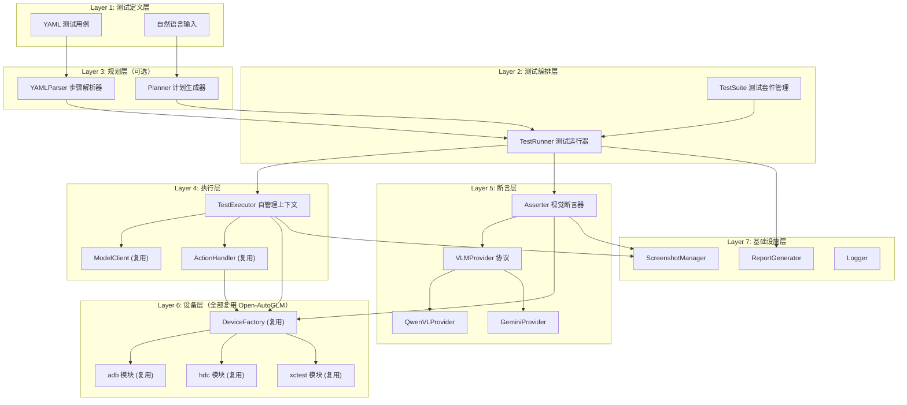

---

## 4. 目录结构

```
auto-qa/
├── auto_qa/
│   ├── __init__.py
│   ├── runner.py                # TestRunner 测试运行器
│   ├── suite.py                 # TestSuite / TestCase 数据模型
│   │
│   ├── executor/
│   │   ├── __init__.py
│   │   └── executor.py          # TestExecutor：自管理上下文，复用 Open-AutoGLM 组件
│   │
│   ├── asserter/
│   │   ├── __init__.py
│   │   ├── asserter.py          # Asserter 视觉断言引擎
│   │   ├── prompts.py           # 断言提示词模板
│   │   └── vlm_providers/
│   │       ├── __init__.py      # VLMProvider 协议 + create_vlm_provider 工厂
│   │       ├── qwen.py          # QwenVLProvider（OpenAI 兼容 API）
│   │       └── gemini.py        # GeminiProvider（Google GenAI SDK）
│   │
│   ├── planner/
│   │   ├── __init__.py
│   │   ├── planner.py           # LLM 规划器：自然语言 → 结构化步骤（可选）
│   │   └── parser.py            # YAML 解析器
│   │
│   ├── report/
│   │   ├── __init__.py
│   │   ├── generator.py         # 报告生成器
│   │   ├── models.py            # 报告数据模型
│   │   └── template.html        # HTML 报告模板
│   │
│   ├── screenshot/
│   │   ├── __init__.py
│   │   └── manager.py           # 截图捕获、存储、生命周期管理
│   │
│   └── config/
│       ├── __init__.py
│       └── settings.py          # 全局配置
│
├── phone_agent/                  # ← 直接引用 Open-AutoGLM（作为依赖或 git submodule）
│   ├── model/client.py          #   ModelClient, ModelConfig, MessageBuilder
│   ├── actions/handler.py       #   ActionHandler, parse_action
│   ├── device_factory.py        #   DeviceFactory, set_device_type
│   ├── adb/                     #   ADB 设备操作
│   ├── hdc/                     #   HDC 设备操作
│   ├── xctest/                  #   iOS 设备操作
│   └── config/                  #   prompts, timing 等
│
├── examples/
│   ├── toutiao_comment.yaml
│   └── douyin_search.yaml
├── main.py                       # CLI 入口
└── setup.py
```

---

## 5. 核心执行流程

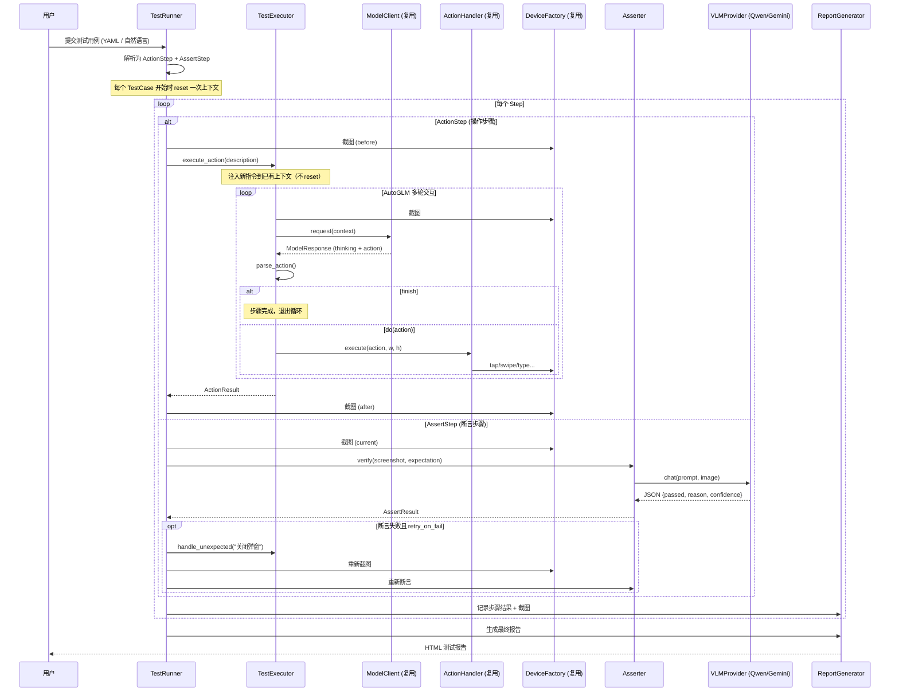

---

## 6. 测试用例定义（YAML DSL）

借鉴 Midscene 的 YAML 设计，增加**断言语义**和**容错配置**：

```yaml
# examples/toutiao_comment.yaml
name: 今日头条评论区红包横幅测试
device:
  type: android          # android | harmony | ios
  id: "emulator-5554"   # 可选，指定设备

config:
  autoglm:
    base_url: "http://localhost:8000/v1"  # OpenAI 兼容 API
    api_key: "${AUTOGLM_API_KEY}"         # 支持环境变量引用
    model: "autoglm-phone-9b"
    max_steps: 10          # 单个 ActionStep 内最大交互轮次
  vlm:
    provider: "qwen"       # qwen | gemini
    # --- Qwen3-VL 配置 ---
    # provider: "qwen"
    # base_url: "https://dashscope.aliyuncs.com/compatible-mode/v1"
    # api_key: "${DASHSCOPE_API_KEY}"
    # model: "qwen-vl-max"
    # --- Gemini 2.5 Pro 配置 ---
    # provider: "gemini"
    # api_key: "${GEMINI_API_KEY}"
    # model: "gemini-2.5-pro"
    base_url: "https://dashscope.aliyuncs.com/compatible-mode/v1"
    api_key: "${DASHSCOPE_API_KEY}"
    model: "qwen-vl-max"
  timeout: 30              # 每步超时秒数
  screenshot_dir: "./screenshots"

tasks:
  - name: 评论区红包横幅验证
    flow:
      # --- 操作步骤 ---
      - action: "打开今日头条 App"
        timeout: 10

      - action: "点击推荐页面中的第一篇文章"

      - action: "向下滑动到评论区"

      # --- 断言步骤 ---
      - assert: "评论区顶部出现了一个发评论得红包的横幅"
        severity: critical       # critical | warning | info
        retryOnFail: true        # 断言失败时尝试清理环境后重试
        retryCleanup: "关闭弹窗或广告"  # 重试前的清理指令

      # --- 也可以混合使用 ---
      - action: "点击红包横幅"
      - assert: "弹出了发评论的输入框"

  - name: 评论区基础功能验证
    continueOnError: true   # 断言失败不中断后续步骤
    flow:
      - action: "打开今日头条，进入任意文章的评论区"
      - assert: "页面上能看到评论列表"
        severity: critical
      - assert: "能看到点赞按钮"
        severity: warning
      - assert: "能看到回复按钮"
        severity: warning
```

### 也支持纯自然语言模式

```yaml
name: 今日头条评论区测试
device:
  type: android

tasks:
  - name: 红包横幅
    # 自然语言模式：Planner 自动拆解为 action + assert
    description: |
      打开今日头条，点击一个文章，点击评论区。
      预期：评论区顶部会出现一个发评论得红包的横幅。
```

---

## 7. 数据模型设计

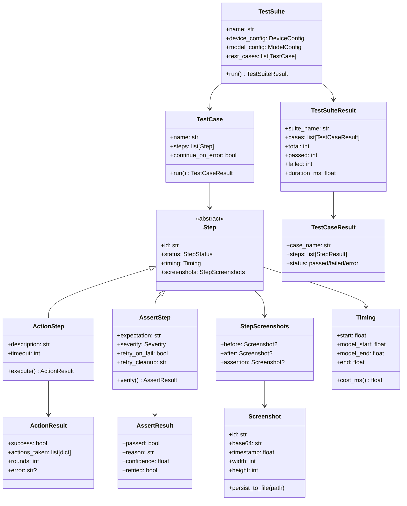

---

## 8. 关键模块设计

### 8.1 TestExecutor — 自管理上下文的执行器（核心）

这是整个框架最关键的模块。**不用 `PhoneAgent`，而是复用其内部组件，自己管理对话上下文。**

#### 为什么不能直接用 PhoneAgent

```python
# PhoneAgent.step() 的问题：
def step(self, task=None):
    is_first = len(self._context) == 0   # 只看 context 是否为空
    return self._execute_step(task, is_first)

def _execute_step(self, user_prompt=None, is_first=False):
    if is_first:
        text = f"{user_prompt}\n\n{screen_info}"    # ← 带任务描述
    else:
        text = f"** Screen Info **\n\n{screen_info}" # ← 丢弃 user_prompt！
```

`step()` 只在第一轮（context 为空时）把任务描述发给模型。如果不 reset，第二个 ActionStep 的新指令根本传不进去。如果 reset，又丢失了上下文。

#### TestExecutor 的设计

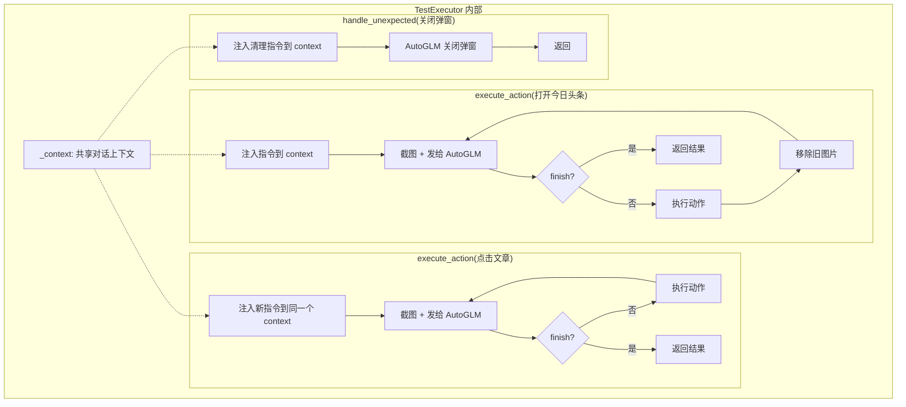

**关键区别：所有 ActionStep 共享同一个 `_context`，每个新步骤都把指令注入到已有上下文中。** AutoGLM 能看到完整的操作历史，更好地理解当前状态。

```python
from phone_agent.model import ModelClient, ModelConfig
from phone_agent.model.client import MessageBuilder
from phone_agent.actions.handler import ActionHandler, parse_action
from phone_agent.config import get_system_prompt
from phone_agent.device_factory import get_device_factory


@dataclass
class ExecutorActionResult:
    """单个 ActionStep 的执行结果"""
    success: bool
    actions_taken: list[dict]    # 所有执行过的动作
    rounds: int                  # 模型交互轮次
    error: str | None = None


class TestExecutor:
    """
    测试执行器：复用 Open-AutoGLM 的组件，自己管理对话上下文。

    与 PhoneAgent 的区别：
    1. 多个 ActionStep 共享同一个上下文（不 reset）
    2. 每个新步骤都能注入新的任务描述
    3. 支持 handle_unexpected() 处理意外情况
    """

    def __init__(self, model_config: ModelConfig, device_id: str | None = None,
                 lang: str = "cn", max_steps_per_action: int = 10):
        # 复用 Open-AutoGLM 组件
        self.model_client = ModelClient(model_config)
        self.action_handler = ActionHandler(device_id=device_id)
        self.device_id = device_id
        self.system_prompt = get_system_prompt(lang)
        self.max_steps = max_steps_per_action

        # 自管理上下文（整个 TestCase 共享）
        self._context: list[dict] = []

    def execute_action(self, description: str) -> ExecutorActionResult:
        """
        执行一个语义级操作步骤。

        与 PhoneAgent.step() 的关键区别：
        - 每次调用都能注入新的任务描述到已有上下文
        - 内部多轮循环直到 AutoGLM 返回 finish
        - 不会 reset 上下文

        Args:
            description: 操作步骤描述，如 "点击第一篇文章"
        """
        device_factory = get_device_factory()
        actions_taken = []

        # 初始化 system prompt（仅首次）
        if not self._context:
            self._context.append(
                MessageBuilder.create_system_message(self.system_prompt)
            )

        # 第一轮：注入新的操作指令
        screenshot = device_factory.get_screenshot(self.device_id)
        current_app = device_factory.get_current_app(self.device_id)
        screen_info = MessageBuilder.build_screen_info(current_app)

        self._context.append(
            MessageBuilder.create_user_message(
                text=f"{description}\n\n{screen_info}",
                image_base64=screenshot.base64_data
            )
        )

        for round_num in range(self.max_steps):
            # 调用 AutoGLM
            try:
                response = self.model_client.request(self._context)
            except Exception as e:
                return ExecutorActionResult(
                    success=False, actions_taken=actions_taken,
                    rounds=round_num + 1, error=f"Model error: {e}"
                )

            # 解析动作
            try:
                action = parse_action(response.action)
            except ValueError:
                action = {"_metadata": "finish", "message": response.action}

            # 移除旧图片，添加 assistant 回复
            self._context[-1] = MessageBuilder.remove_images_from_message(
                self._context[-1]
            )
            self._context.append(
                MessageBuilder.create_assistant_message(
                    f"<think>{response.thinking}</think>"
                    f"<answer>{response.action}</answer>"
                )
            )

            # finish → 步骤完成
            if action.get("_metadata") == "finish":
                return ExecutorActionResult(
                    success=True, actions_taken=actions_taken,
                    rounds=round_num + 1
                )

            # 执行动作
            result = self.action_handler.execute(
                action, screenshot.width, screenshot.height
            )
            actions_taken.append(action)

            if result.should_finish:
                return ExecutorActionResult(
                    success=result.success, actions_taken=actions_taken,
                    rounds=round_num + 1, error=result.message
                )

            # 下一轮：只发截图和 screen_info，不发新指令
            screenshot = device_factory.get_screenshot(self.device_id)
            current_app = device_factory.get_current_app(self.device_id)
            screen_info = MessageBuilder.build_screen_info(current_app)

            self._context.append(
                MessageBuilder.create_user_message(
                    text=f"** Screen Info **\n\n{screen_info}",
                    image_base64=screenshot.base64_data
                )
            )

        return ExecutorActionResult(
            success=False, actions_taken=actions_taken,
            rounds=self.max_steps, error="max_steps exceeded"
        )

    def handle_unexpected(self, instruction: str = "关闭当前弹窗或广告",
                          max_steps: int = 3) -> bool:
        """
        处理意外情况（弹窗、广告等）。

        向已有上下文注入清理指令，让 AutoGLM 处理干扰后继续。

        Args:
            instruction: 清理指令
            max_steps: 最多尝试几轮
        """
        original_max = self.max_steps
        self.max_steps = max_steps
        result = self.execute_action(instruction)
        self.max_steps = original_max
        return result.success

    def reset(self):
        """重置上下文（切换 TestCase 时调用）"""
        self._context = []
```

#### 上下文共享 vs 每步 reset 的对比

```
方案 A: 每步 reset（之前的设计）
  ┌──────────┐    ┌──────────┐    ┌──────────┐
  │ Step 1   │    │ Step 2   │    │ Step 3   │
  │ [ctx]    │    │ [ctx]    │    │ [ctx]    │
  │ 独立上下文│    │ 独立上下文│    │ 独立上下文│
  └──────────┘    └──────────┘    └──────────┘
  问题：AutoGLM 不知道之前做了什么，弹窗场景下容易困惑

方案 B: 共享上下文（当前设计）✅
  ┌──────────────────────────────────────────┐
  │              共享 _context               │
  │                                          │
  │ [system] → [Step1 指令+图] → [回复]      │
  │         → [Step2 指令+图] → [回复]       │
  │         → [清理弹窗指令+图] → [回复]      │
  │         → [Step3 指令+图] → [回复]       │
  └──────────────────────────────────────────┘
  优势：AutoGLM 有完整操作历史，理解当前状态更准确
```

### 8.2 Asserter — 可插拔 VLM 视觉断言器

#### VLM Provider 抽象层

两个 VLM 的 API 格式不同，需要统一抽象：

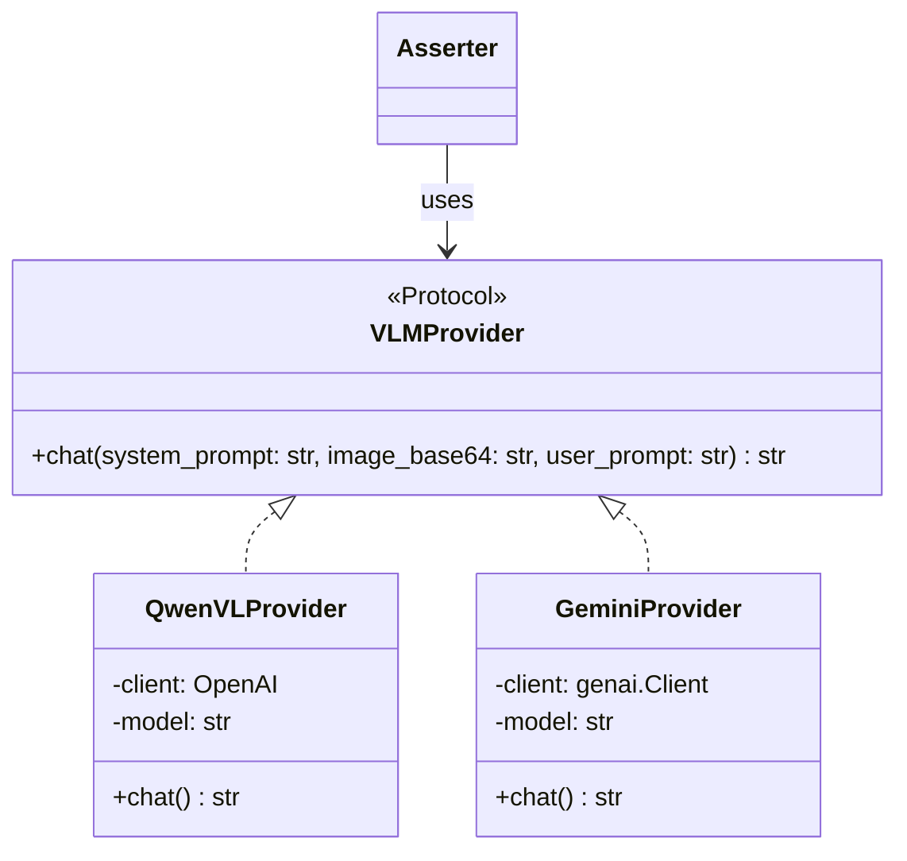

| 维度 | Qwen3-VL | Gemini 2.5 Pro |
|------|----------|----------------|
| SDK | `openai` (兼容模式) | `google-genai` |
| 图片传入 | `image_url` (base64 data URI) | `inline_data` (Part 对象) |
| API 格式 | OpenAI Chat Completions | Gemini GenerateContent |
| system prompt | `role: "system"` | `system_instruction` 参数 |
| 输出 | `choices[0].message.content` | `response.text` |

#### 配置模型

```python
@dataclass
class VLMConfig:
    """VLM 配置，支持多 provider"""
    provider: str = "qwen"          # "qwen" | "gemini"
    base_url: str = ""              # Qwen 需要，Gemini 不需要
    api_key: str = ""
    model: str = "qwen-vl-max"     # 根据 provider 有不同默认值
    temperature: float = 0.1        # 断言场景用低温度
    max_tokens: int = 1000
```

#### Provider 实现

```python
class VLMProvider(Protocol):
    """VLM 提供者协议：统一不同模型的调用接口"""

    def chat(self, system_prompt: str, image_base64: str,
             user_prompt: str) -> str:
        """发送图文请求，返回模型原始文本响应"""
        ...


class QwenVLProvider:
    """Qwen3-VL 通过 OpenAI 兼容 API 调用（DashScope / 自部署）"""

    def __init__(self, config: VLMConfig):
        from openai import OpenAI
        self.client = OpenAI(base_url=config.base_url, api_key=config.api_key)
        self.model = config.model
        self.temperature = config.temperature
        self.max_tokens = config.max_tokens

    def chat(self, system_prompt: str, image_base64: str,
             user_prompt: str) -> str:
        messages = [
            {"role": "system", "content": system_prompt},
            {"role": "user", "content": [
                {
                    "type": "image_url",
                    "image_url": {
                        "url": f"data:image/png;base64,{image_base64}"
                    },
                },
                {"type": "text", "text": user_prompt},
            ]},
        ]

        response = self.client.chat.completions.create(
            model=self.model,
            messages=messages,
            temperature=self.temperature,
            max_tokens=self.max_tokens,
        )
        return response.choices[0].message.content


class GeminiProvider:
    """Gemini 2.5 Pro 通过 Google GenAI SDK 调用"""

    def __init__(self, config: VLMConfig):
        from google import genai
        self.client = genai.Client(api_key=config.api_key)
        self.model = config.model
        self.temperature = config.temperature
        self.max_tokens = config.max_tokens

    def chat(self, system_prompt: str, image_base64: str,
             user_prompt: str) -> str:
        import base64
        from google.genai import types

        image_bytes = base64.b64decode(image_base64)

        response = self.client.models.generate_content(
            model=self.model,
            contents=[
                types.Part.from_bytes(data=image_bytes, mime_type="image/png"),
                types.Part.from_text(text=user_prompt),
            ],
            config=types.GenerateContentConfig(
                system_instruction=system_prompt,
                temperature=self.temperature,
                max_output_tokens=self.max_tokens,
            ),
        )
        return response.text


def create_vlm_provider(config: VLMConfig) -> VLMProvider:
    """工厂函数：根据 provider 配置创建对应的 VLM 实例"""
    providers = {
        "qwen": QwenVLProvider,
        "gemini": GeminiProvider,
    }
    cls = providers.get(config.provider)
    if cls is None:
        raise ValueError(
            f"Unknown VLM provider: {config.provider}, "
            f"supported: {list(providers.keys())}"
        )
    return cls(config)
```

#### Asserter 核心

```python
class Asserter:
    """基于 VLM 的视觉断言引擎，支持可插拔的模型后端"""

    SYSTEM_PROMPT = """你是一个视觉测试断言引擎。
根据提供的手机截图，判断给定的期望描述是否成立。

输出严格的 JSON 格式：
{
  "passed": true/false,
  "reason": "判断依据的详细说明",
  "confidence": 0.0-1.0
}

规则：
1. 仔细观察截图中的所有 UI 元素
2. 只根据截图中可见的内容做判断，不要推测不可见的部分
3. reason 字段要具体指出看到了什么/没看到什么
4. confidence 表示你对判断的确信程度
"""

    def __init__(self, vlm_config: VLMConfig):
        self.provider = create_vlm_provider(vlm_config)

    def verify(self, screenshot: Screenshot, expectation: str) -> AssertResult:
        raw = self.provider.chat(
            system_prompt=self.SYSTEM_PROMPT,
            image_base64=screenshot.base64,
            user_prompt=f"请判断以下期望是否成立：\n{expectation}",
        )

        result = json.loads(raw)
        return AssertResult(
            passed=result["passed"],
            reason=result["reason"],
            confidence=result["confidence"],
        )
```

**断言类型扩展（未来）：**

```yaml
# 基础视觉断言
- assert: "页面上有红包横幅"

# 带容忍度的断言
- assert: "评论区在页面下半部分"
  confidence_threshold: 0.8

# 否定断言
- assertNot: "页面出现了错误提示"

# 等待断言（轮询直到满足条件或超时）
- waitFor: "加载动画消失"
  timeout: 10

# 数据提取 + 断言（参考 Midscene 的 aiQuery）
- query: "页面上第一篇文章的标题"
  saveTo: article_title
- assert: "{{article_title}} 不为空"
```

### 8.3 Planner — 自然语言 → 结构化步骤（可选）

```python
class Planner:
    """将自然语言测试描述拆解为结构化步骤"""

    SYSTEM_PROMPT = """你是一个测试计划生成器。将用户的测试描述拆解为操作步骤和断言步骤。
输出 JSON 格式：
[
  {"type": "action", "description": "打开今日头条 App"},
  {"type": "action", "description": "点击推荐页面中的第一篇文章"},
  {"type": "action", "description": "向下滑动到评论区"},
  {"type": "assert", "expectation": "评论区顶部出现发评论得红包的横幅", "severity": "critical"}
]

规则：
1. 操作步骤用祈使句，描述要做什么
2. 断言步骤描述期望看到的视觉结果
3. "预期"、"应该"、"会出现" 等关键词表示断言
4. 保持步骤粒度适中，一个操作对应一个动作
"""

    def plan(self, description: str) -> list[Step]:
        response = self.llm_client.chat(
            system=self.SYSTEM_PROMPT, user=description
        )
        return self._parse_steps(response)
```

**推荐：先支持 YAML 模式，Planner 作为可选增强。** YAML 可复现、无歧义，适合回归测试。

---

## 9. TestRunner 编排逻辑与容错机制

### 9.1 容错设计

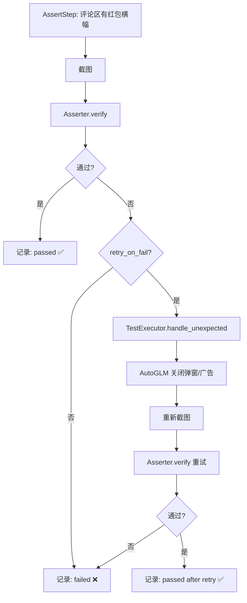

**容错的三个层级：**

| 层级 | 机制 | 处理什么 |
|------|------|----------|
| **ActionStep 内部** | AutoGLM 多轮循环 | 操作过程中出现的弹窗——AutoGLM 看到截图自然会处理 |
| **AssertStep 失败重试** | `handle_unexpected()` + 重新断言 | 断言时屏幕被弹窗遮挡——先清理再重试 |
| **TestCase 级别** | `continueOnError` | 某步骤彻底失败——跳过继续后续步骤 |

### 9.2 完整编排代码

```python
class TestRunner:
    """测试运行器：编排 TestExecutor + Asserter 的完整流程"""

    def __init__(self, executor: TestExecutor, asserter: Asserter,
                 planner: Planner | None = None):
        self.executor = executor
        self.asserter = asserter
        self.planner = planner
        self.screenshot_mgr = ScreenshotManager()
        self.report = ReportGenerator()

    def run_suite(self, suite: TestSuite) -> TestSuiteResult:
        results = []
        for case in suite.test_cases:
            result = self.run_case(case)
            results.append(result)

        report_path = self.report.generate(suite.name, results)
        return TestSuiteResult(cases=results, report_path=report_path)

    def run_case(self, case: TestCase) -> TestCaseResult:
        # 每个 TestCase 重置一次上下文
        self.executor.reset()

        steps = case.steps or self.planner.plan(case.description)
        step_results = []

        for step in steps:
            if isinstance(step, ActionStep):
                result = self._run_action(step)
            elif isinstance(step, AssertStep):
                result = self._run_assert(step)
            else:
                continue

            step_results.append(result)

            if not result.success and not case.continue_on_error:
                break

        status = "passed" if all(r.success for r in step_results) else "failed"
        return TestCaseResult(case_name=case.name, steps=step_results, status=status)

    def _run_action(self, step: ActionStep) -> StepResult:
        before = self.screenshot_mgr.capture()

        timing = Timing.start()
        result = self.executor.execute_action(step.description)
        timing.end()

        after = self.screenshot_mgr.capture()

        return StepResult(
            step=step,
            success=result.success,
            screenshots=StepScreenshots(before=before, after=after),
            timing=timing,
            detail=result,
        )

    def _run_assert(self, step: AssertStep) -> StepResult:
        screenshot = self.screenshot_mgr.capture()

        timing = Timing.start()
        result = self.asserter.verify(screenshot, step.expectation)

        # 容错：断言失败 → 尝试清理环境 → 重试
        if not result.passed and step.retry_on_fail:
            cleanup_instruction = step.retry_cleanup or "关闭当前弹窗或广告"
            self.executor.handle_unexpected(cleanup_instruction)

            screenshot = self.screenshot_mgr.capture()
            result = self.asserter.verify(screenshot, step.expectation)
            result.retried = True

        timing.end()

        return StepResult(
            step=step,
            success=result.passed,
            screenshots=StepScreenshots(assertion=screenshot),
            timing=timing,
            detail=result,
        )
```

### 9.3 状态机视图

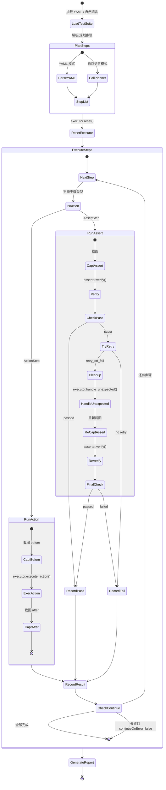

---

## 10. 报告系统

### 报告数据模型

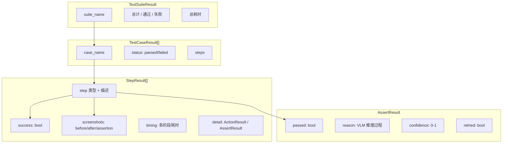

### HTML 报告结构

```
┌──────────────────────────────────────────────────┐
│  AutoQA Report                               │
│  2024-01-15 14:30:22 | 3 cases | 2 passed 1 fail│
├──────────────────────────────────────────────────┤
│                                                  │
│  ✅ 评论区红包横幅验证                             │
│  ┌────────────────────────────────────────────┐  │
│  │ Step 1: 打开今日头条 App          ✅ 3.2s  │  │
│  │ [before 截图]  →  [after 截图]             │  │
│  │ AutoGLM: 2 rounds, Tap → Launch            │  │
│  ├────────────────────────────────────────────┤  │
│  │ Step 2: 点击第一篇文章            ✅ 2.1s  │  │
│  │ [before 截图]  →  [after 截图]             │  │
│  ├────────────────────────────────────────────┤  │
│  │ Step 3: 向下滑动到评论区          ✅ 1.8s  │  │
│  │ [before 截图]  →  [after 截图]             │  │
│  ├────────────────────────────────────────────┤  │
│  │ Step 4: [断言] 评论区有红包横幅    ✅ 1.5s  │  │
│  │ [assertion 截图]                           │  │
│  │ Qwen3-VL: "截图顶部可见红色横幅，         │  │
│  │   文字为'发评论得红包'，判断通过"           │  │
│  │ confidence: 0.95                           │  │
│  └────────────────────────────────────────────┘  │
│                                                  │
│  ✅ 弹窗干扰场景 (retried)                        │
│  ┌────────────────────────────────────────────┐  │
│  │ Step 1: 打开 App                  ✅ 3.0s  │  │
│  ├────────────────────────────────────────────┤  │
│  │ Step 2: [断言] 首页正常显示  ✅ (retry) 4s │  │
│  │ [第一次截图: 弹窗遮挡]                     │  │
│  │ → handle_unexpected("关闭弹窗")            │  │
│  │ [重试截图: 弹窗已关闭]                     │  │
│  │ Qwen3-VL: "首页内容正常显示，判断通过"     │  │
│  └────────────────────────────────────────────┘  │
└──────────────────────────────────────────────────┘
```

两种存储模式（参考 Midscene）：
- **inline 模式**：单个 HTML 文件，截图用 base64 内嵌（方便分享）
- **directory 模式**：HTML + screenshots/ 目录（大规模测试用）

---

## 11. 与 Midscene 架构的对比

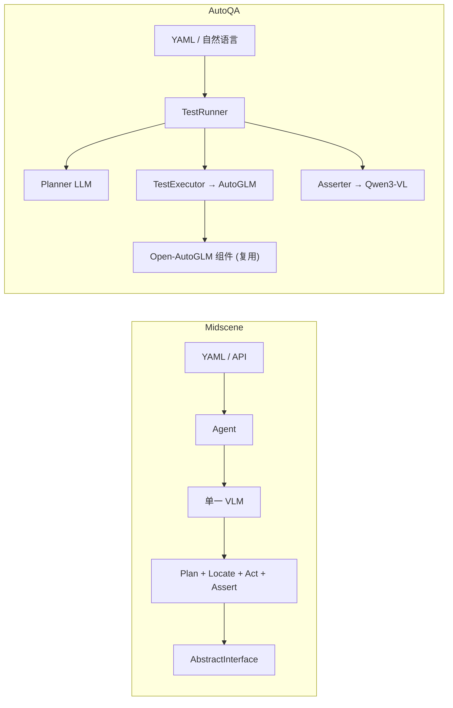

| 维度 | Midscene | AutoQA |
|------|----------|------------|
| **模型策略** | 单模型（或可切换） | 双模型各司其职 |
| **操作模型** | LLM / UI-TARS / AutoGLM 三选一 | AutoGLM（通过复用组件） |
| **断言模型** | 同一个模型做断言 | 独立 VLM，可插拔（Qwen3-VL / Gemini 2.5 Pro） |
| **设备层** | 自研 AbstractInterface | 复用 Open-AutoGLM DeviceFactory |
| **容错机制** | 无专用机制 | handle_unexpected + 断言重试 |
| **平台** | Web + Mobile + Desktop | Mobile（Android/HarmonyOS/iOS） |
| **定位** | 通用 UI 自动化 SDK | 专用移动端测试框架 |
| **复杂度** | 高（SDK、多平台、MCP） | 中（聚焦测试场景，大量复用） |

---

## 12. 架构关键设计决策

### 决策 1：复用 Open-AutoGLM 组件，不用 PhoneAgent 顶层接口

| 方案 | 优点 | 缺点 |
|------|------|------|
| 用 `PhoneAgent.run()` | 零代码 | 无法中途插入断言 |
| 用 `PhoneAgent.step()` | 单步控制 | 多步串联时新指令传不进去 |
| **复用中底层组件** | 完全控制上下文 + 注入新指令 + 容错 | 需要自己管理 context |

选择方案三，因为测试框架需要在操作步骤之间插入断言和容错处理，这要求对对话上下文有完全的控制权。

### 决策 2：整个 TestCase 共享 AutoGLM 上下文

- **不每步 reset**：AutoGLM 能看到完整操作历史，遇到弹窗时知道上下文，能更准确地处理
- **每个 TestCase reset**：不同测试用例之间互不干扰，避免上下文膨胀
- **移除旧截图**：复用 Open-AutoGLM 的 `MessageBuilder.remove_images_from_message()`，防止 token 超限

### 决策 3：三级容错机制

```
Level 1 — ActionStep 内部自动处理
    AutoGLM 多轮循环中，看到弹窗自然会关闭它再继续任务
    无需额外代码，这是 AutoGLM 的原生能力

Level 2 — AssertStep 失败重试
    断言失败 → handle_unexpected("关闭弹窗") → 重新截图 → 重新断言
    需要 YAML 中配置 retryOnFail: true

Level 3 — TestCase 级跳过
    步骤彻底失败 → continueOnError: true → 跳过继续后续步骤
    保证一个失败不会阻塞整个测试套件
```

### 决策 4：为什么不直接用 AutoGLM 做断言？

```
AutoGLM 的训练目标：给定截图 + 任务 → 输出下一步操作
通用 VLM 的训练目标：给定图片 + 问题 → 输出语义理解
```

AutoGLM 是"操作专家"，不是"理解专家"。让它判断"页面上是否有红包横幅"不是它的强项。通用 VLM 在图像理解和推理上更全面，且能输出结构化的判断理由。

### 决策 5：VLM 可插拔设计

断言模型采用 Provider 协议抽象，支持按需切换：

| VLM | 优势 | 适合场景 |
|-----|------|----------|
| **Qwen3-VL** | 中文 UI 理解好，DashScope API 国内访问快 | 国内 App 测试，中文界面 |
| **Gemini 2.5 Pro** | 多语言能力强，推理能力强 | 多语言 App，复杂断言逻辑 |

扩展新 Provider 只需实现 `VLMProvider` 协议（一个 `chat` 方法），注册到 `create_vlm_provider` 工厂即可。所有模型均通过远程 API 调用，不需要本地 GPU。

### 决策 6：YAML 优先，自然语言可选

| 模式 | 可复现 | 无歧义 | 编写成本 | 适合场景 |
|------|--------|--------|----------|----------|
| YAML | ✅ | ✅ | 中 | 回归测试、CI |
| 自然语言 | ❌ | ❌ | 低 | 探索性测试、快速原型 |

可以先用自然语言生成 YAML，人工审核后固化为回归用例。

---

## 13. 整体数据流

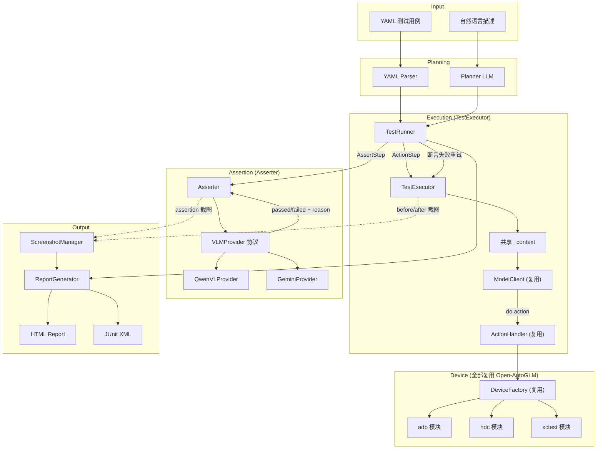

---

## 14. 扩展点

### 14.1 扩展 VLM Provider

添加新的 VLM 只需实现 `VLMProvider` 协议并注册到工厂：

```python
# 示例：添加 Claude VLM 支持
class ClaudeProvider:
    def __init__(self, config: VLMConfig):
        from anthropic import Anthropic
        self.client = Anthropic(api_key=config.api_key)
        self.model = config.model

    def chat(self, system_prompt, image_base64, user_prompt):
        response = self.client.messages.create(
            model=self.model,
            system=system_prompt,
            messages=[{"role": "user", "content": [
                {"type": "image", "source": {
                    "type": "base64", "media_type": "image/png",
                    "data": image_base64,
                }},
                {"type": "text", "text": user_prompt},
            ]}],
        )
        return response.content[0].text

# 注册到工厂
# create_vlm_provider 的 providers dict 中添加 "claude": ClaudeProvider
```

### 14.2 插件化断言策略

除了 VLM 断言，还可扩展其他断言方式：

```python
class AssertPlugin(Protocol):
    """断言插件协议"""
    def can_handle(self, step: AssertStep) -> bool: ...
    def verify(self, screenshot: Screenshot, step: AssertStep) -> AssertResult: ...

# 内置
class VLMAssertPlugin:       # VLM 视觉断言（默认，通过 VLMProvider）
class OCRAssertPlugin:       # OCR 文字提取断言
class PixelDiffPlugin:       # 像素对比断言（与 baseline 截图对比）
```

### 14.3 自定义 Hook

```python
class TestHook(Protocol):
    def before_step(self, step: Step): ...
    def after_step(self, step: Step, result: StepResult): ...
    def on_assert_fail(self, step: AssertStep, result: AssertResult): ...

# 示例：断言失败时自动录屏
class ScreenRecordOnFailHook:
    def on_assert_fail(self, step, result):
        self.device.start_screenrecord()
        # ... 重试 ...
        self.device.stop_screenrecord()
```

### 14.4 CI/CD 集成

```yaml
# GitHub Actions 示例
- name: Run AutoQA
  run: |
    autoqa run tests/ --device android --report junit
  env:
    AUTOGLM_API_KEY: ${{ secrets.AUTOGLM_API_KEY }}
    VLM_API_KEY: ${{ secrets.VLM_API_KEY }}
```

---

## 15. 实施计划

### 总览

```
Phase 1 ██████░░░░░░░░░░░░░░░░░░░░░░  项目骨架 + VLM Provider
Phase 2 ░░░░░░████░░░░░░░░░░░░░░░░░░  断言能力 (Asserter)
Phase 3 ░░░░░░████░░░░░░░░░░░░░░░░░░  执行能力 (TestExecutor)  ← 与 Phase 2 可并行
Phase 4 ░░░░░░░░░░████████░░░░░░░░░░  编排串联 (Runner + YAML + CLI) ← 第一个可交付版本
Phase 5 ░░░░░░░░░░░░░░░░░░█████░░░░░  测试报告 (HTML)
Phase 6 ░░░░░░░░░░░░░░░░░░░░░░░█████  增强功能 (按需)
```

### 依赖关系

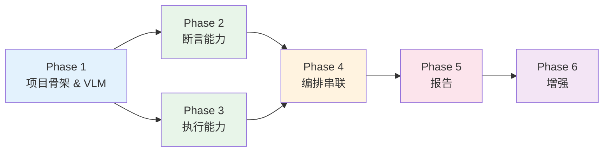

> Phase 2（断言）和 Phase 3（执行）互相独立，可以并行开发。

---

### Phase 1：项目骨架 & VLM Provider

**目标：** 项目能跑起来，VLM 能对一张截图做出判断。

**要实现的文件：**

```
auto_qa/
├── __init__.py
├── config/
│   ├── __init__.py
│   └── settings.py          # VLMConfig, AutoGLMConfig, DeviceConfig 数据类
└── asserter/
    └── vlm_providers/
        ├── __init__.py       # VLMProvider 协议 + create_vlm_provider 工厂
        ├── qwen.py           # QwenVLProvider
        └── gemini.py         # GeminiProvider
```

**具体任务：**

| # | 任务 | 文件 | 说明 |
|---|------|------|------|
| 1.1 | 项目初始化 | `setup.py` / `pyproject.toml` | 创建 Python 包，声明依赖：`openai`, `google-genai`, `pyyaml` |
| 1.2 | 配置数据类 | `config/settings.py` | `VLMConfig(provider, base_url, api_key, model, temperature, max_tokens)` |
| 1.3 | VLMProvider 协议 | `asserter/vlm_providers/__init__.py` | `Protocol` 定义 + `create_vlm_provider()` 工厂 |
| 1.4 | QwenVLProvider | `asserter/vlm_providers/qwen.py` | 通过 `openai` SDK 调用 DashScope 兼容 API |
| 1.5 | GeminiProvider | `asserter/vlm_providers/gemini.py` | 通过 `google-genai` SDK 调用 Gemini API |
| 1.6 | 环境变量支持 | `config/settings.py` | 从环境变量读取 API key，支持 `${VAR}` 语法 |

**验证方式：**

```python
# 手动验证脚本
from auto_qa.config.settings import VLMConfig
from auto_qa.asserter.vlm_providers import create_vlm_provider

config = VLMConfig(provider="qwen", api_key="sk-xxx", model="qwen-vl-max",
                   base_url="https://dashscope.aliyuncs.com/compatible-mode/v1")
provider = create_vlm_provider(config)

# 用一张本地截图测试
with open("test_screenshot.png", "rb") as f:
    import base64
    img_b64 = base64.b64encode(f.read()).decode()

result = provider.chat(
    system_prompt="判断截图中是否有按钮，回复 JSON: {\"has_button\": true/false}",
    image_base64=img_b64,
    user_prompt="请判断"
)
print(result)  # 应输出 JSON 字符串
```

**完成标志：** 两个 Provider 都能正确接收截图并返回文本响应。

---

### Phase 2：断言能力

**目标：** 给一张截图和一句期望描述，能返回 pass/fail + 理由。

**要实现的文件：**

```
auto_qa/
├── asserter/
│   ├── __init__.py
│   ├── asserter.py           # Asserter 核心类
│   ├── prompts.py            # SYSTEM_PROMPT 断言提示词
│   └── vlm_providers/        # (Phase 1 已完成)
├── screenshot/
│   ├── __init__.py
│   └── manager.py            # ScreenshotManager
└── config/
    └── settings.py           # 新增 Screenshot 数据类、AssertResult 数据类
```

**具体任务：**

| # | 任务 | 文件 | 说明 |
|---|------|------|------|
| 2.1 | 基础数据模型 | `config/settings.py` | `Screenshot(id, base64, width, height, timestamp)`, `AssertResult(passed, reason, confidence, retried)` |
| 2.2 | 断言提示词 | `asserter/prompts.py` | `ASSERT_SYSTEM_PROMPT`，要求输出 JSON `{passed, reason, confidence}` |
| 2.3 | Asserter 核心 | `asserter/asserter.py` | `Asserter.__init__(vlm_config)` → 创建 Provider；`verify(screenshot, expectation)` → 调 Provider → 解析 JSON → 返回 AssertResult |
| 2.4 | ScreenshotManager | `screenshot/manager.py` | `capture(device_factory, device_id)` → 调用 `DeviceFactory.get_screenshot()` → 封装为 `Screenshot`；`persist_to_file(screenshot, path)` → 保存 PNG |

**验证方式：**

```python
from phone_agent.device_factory import set_device_type, get_device_factory, DeviceType
from auto_qa.asserter import Asserter
from auto_qa.screenshot import ScreenshotManager
from auto_qa.config.settings import VLMConfig

set_device_type(DeviceType.ADB)
screenshot_mgr = ScreenshotManager()
screenshot = screenshot_mgr.capture(get_device_factory())

asserter = Asserter(VLMConfig(provider="qwen", ...))

# 打开今日头条首页后测试
result = asserter.verify(screenshot, "页面上有今日头条的 Logo")
print(f"passed={result.passed}, reason={result.reason}, confidence={result.confidence}")
```

**完成标志：** 能对真实设备截图做视觉断言，输出结构化的 pass/fail 结果。

---

### Phase 3：执行能力

**目标：** 能用自然语言描述一个操作，AutoGLM 自动多轮执行完成。弹窗等意外能处理。

**要实现的文件：**

```
auto_qa/
└── executor/
    ├── __init__.py
    └── executor.py            # TestExecutor 核心类
```

**具体任务：**

| # | 任务 | 文件 | 说明 |
|---|------|------|------|
| 3.1 | ExecutorActionResult | `executor/executor.py` | 数据类：`success, actions_taken, rounds, error` |
| 3.2 | TestExecutor 核心 | `executor/executor.py` | `__init__` 初始化复用组件；`execute_action(description)` 多轮循环；上下文管理（不 reset） |
| 3.3 | handle_unexpected | `executor/executor.py` | 注入清理指令到已有上下文，限制 max_steps=3 |
| 3.4 | reset | `executor/executor.py` | 清空 `_context`，TestCase 切换时调用 |

**核心实现要点（参考 8.1 节代码）：**

1. **首次调用**：注入 system_prompt → 注入 `{description}\n\n{screen_info}` + 截图
2. **多轮循环**：调用 ModelClient → parse_action → 执行动作 → 下一轮只发截图
3. **上下文共享**：多个 ActionStep 之间不 reset，新步骤的描述直接追加到 context
4. **图片清理**：每轮执行后 `MessageBuilder.remove_images_from_message()` 移除旧图

**验证方式：**

```python
from phone_agent.model import ModelConfig
from phone_agent.device_factory import set_device_type, DeviceType
from auto_qa.executor import TestExecutor

set_device_type(DeviceType.ADB)
executor = TestExecutor(ModelConfig(base_url="http://localhost:8000/v1"))

# 测试单步执行
result = executor.execute_action("打开今日头条 App")
print(f"success={result.success}, rounds={result.rounds}")

# 测试上下文保持（不 reset，继续下一步）
result = executor.execute_action("点击推荐页面中的第一篇文章")
print(f"success={result.success}, rounds={result.rounds}")

# 测试弹窗处理
executor.handle_unexpected("关闭当前弹窗或广告")
```

**完成标志：** 能连续执行多个操作步骤，AutoGLM 保持上下文理解当前状态；`handle_unexpected` 能关闭弹窗。

---

### Phase 4：编排串联（端到端可用）

**目标：** 写一个 YAML 文件，命令行一行跑完测试，控制台输出 pass/fail。

**要实现的文件：**

```
auto_qa/
├── planner/
│   ├── __init__.py
│   └── parser.py              # YAML 解析器
├── runner.py                  # TestRunner
├── suite.py                   # TestSuite, TestCase, ActionStep, AssertStep 等
main.py                        # CLI 入口
examples/
└── toutiao_comment.yaml       # 示例用例
```

**具体任务：**

| # | 任务 | 文件 | 说明 |
|---|------|------|------|
| 4.1 | 步骤数据模型 | `suite.py` | `TestSuite`, `TestCase`, `ActionStep`, `AssertStep`, `StepResult`, `TestCaseResult`, `TestSuiteResult` |
| 4.2 | YAML 解析器 | `planner/parser.py` | 读取 YAML → 解析 `device`, `config`, `tasks[].flow[]` → 构建 `TestSuite` 对象；支持 `${ENV_VAR}` 环境变量替换 |
| 4.3 | TestRunner | `runner.py` | `run_suite()` → 遍历 TestCase；`run_case()` → reset executor → 遍历 steps；`_run_action()` / `_run_assert()` 含容错重试 |
| 4.4 | 容错重试逻辑 | `runner.py` | 断言失败时：检查 `retry_on_fail` → `handle_unexpected(cleanup)` → 重新截图 → 重新断言 |
| 4.5 | CLI 入口 | `main.py` | `argparse`：`autoqa run <yaml_path> --device-type adb --device-id xxx`；初始化设备 → 解析 YAML → 运行 → 输出结果 |
| 4.6 | 示例用例 | `examples/toutiao_comment.yaml` | 参考第 6 节的 YAML 格式 |

**验证方式：**

```bash
# 完整端到端测试
python main.py run examples/toutiao_comment.yaml --device-type adb

# 预期输出：
# ✅ Step 1: 打开今日头条 App (3 rounds, 4.2s)
# ✅ Step 2: 点击推荐页面中的第一篇文章 (2 rounds, 2.8s)
# ✅ Step 3: 向下滑动到评论区 (1 round, 1.5s)
# ✅ Step 4: [断言] 评论区顶部出现了红包横幅 (confidence: 0.93)
#
# Result: 4/4 passed ✅
```

**完成标志：** `python main.py run xxx.yaml` 能完整跑通一个测试用例，控制台输出每步结果。**这是第一个可交付的里程碑。**

---

### Phase 5：测试报告

**目标：** 生成带截图、带 VLM 推理过程的 HTML 可视化报告。

**要实现的文件：**

```
auto_qa/
└── report/
    ├── __init__.py
    ├── generator.py           # ReportGenerator
    ├── models.py              # 报告数据模型（如果与 suite.py 的模型不同）
    └── template.html          # HTML 报告 Jinja2 模板
```

**具体任务：**

| # | 任务 | 文件 | 说明 |
|---|------|------|------|
| 5.1 | Timing 统计 | `suite.py` | 给 StepResult 添加 `Timing(start, model_start, model_end, end)`；在 TestRunner 的 `_run_action` / `_run_assert` 中打时间戳 |
| 5.2 | ScreenshotManager 增强 | `screenshot/manager.py` | `persist_to_dir(screenshots, dir)` 批量保存；inline 模式 base64 嵌入 |
| 5.3 | HTML 模板 | `report/template.html` | Jinja2 模板：Suite 概览 → Case 列表 → Step 详情 + 截图 + 断言理由；参考第 10 节的报告结构 |
| 5.4 | ReportGenerator | `report/generator.py` | `generate(suite_result, output_path, mode="inline"/"directory")` → 渲染模板 → 写入 HTML；inline 模式截图 base64 嵌入；directory 模式截图存 PNG |
| 5.5 | CLI 集成 | `main.py` | 新增 `--report` 参数：`--report html`（默认）/ `--report junit`（后续 Phase 6） |

**验证方式：**

```bash
python main.py run examples/toutiao_comment.yaml --report html --output report.html
# 打开 report.html，检查：
# - 每步有 before/after 截图
# - 断言步骤有 VLM 的 reason 文字
# - 失败步骤有红色标记
# - 重试步骤有重试标记
```

**完成标志：** 生成的 HTML 报告在浏览器中能清晰展示完整测试过程，截图可查看。

---

### Phase 6：增强功能

**目标：** 完善框架能力，支持更多场景。按优先级逐个实现。

| # | 任务 | 优先级 | 说明 |
|---|------|--------|------|
| 6.1 | `continueOnError` | 高 | TestRunner 中已预留，补充 YAML 解析支持 |
| 6.2 | `waitFor` 轮询断言 | 高 | `Asserter.wait_for(screenshot_fn, expectation, timeout, interval)` 循环截图+断言直到通过或超时 |
| 6.3 | Planner | 中 | 自然语言 → ActionStep/AssertStep 列表；可复用 Qwen3-VL 或独立 LLM |
| 6.4 | JUnit XML 输出 | 中 | `ReportGenerator.generate_junit(suite_result, path)` 输出标准 JUnit XML，方便 CI 集成 |
| 6.5 | 日志系统 | 中 | `logging` 模块配置；handle_unexpected 过程记录；AutoGLM 每轮 thinking 记录 |
| 6.6 | iOS 支持 | 低 | 复用 `phone_agent.xctest`；需要处理 WDA 连接和 SCALE_FACTOR |
| 6.7 | 断言插件系统 | 低 | `AssertPlugin` 协议 + 插件注册机制 |
| 6.8 | 并行测试 | 低 | 多设备并行执行不同 TestCase |

---

### 各阶段文件产出汇总

```
Phase 1                          Phase 2                    Phase 3
─────────────────────           ──────────────────         ──────────────────
config/                          asserter/                  executor/
├── __init__.py                  ├── __init__.py            ├── __init__.py
└── settings.py ★                ├── asserter.py ★          └── executor.py ★
asserter/vlm_providers/          └── prompts.py ★
├── __init__.py ★                screenshot/
├── qwen.py ★                   ├── __init__.py
└── gemini.py ★                 └── manager.py ★

Phase 4                          Phase 5                    Phase 6
─────────────────────           ──────────────────         ──────────────────
suite.py ★                       report/                    planner/
planner/                         ├── __init__.py            └── planner.py ★
├── __init__.py                  ├── generator.py ★         (各模块增量修改)
└── parser.py ★                 ├── models.py
runner.py ★                     └── template.html ★
main.py ★
examples/
└── toutiao_comment.yaml ★

★ = 需要新写的核心文件
```

### 里程碑检查点

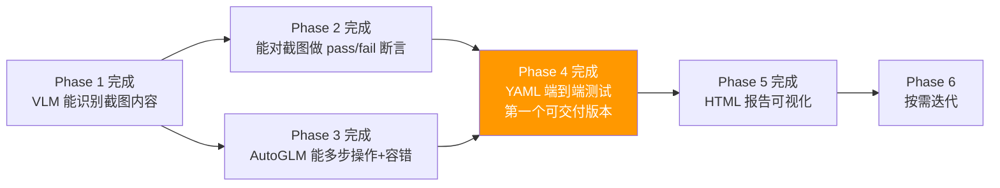

---

## 16. 复用清单

明确哪些直接复用 Open-AutoGLM，哪些需要新写：

| 模块 | 来源 | 说明 |
|------|------|------|
| `ModelClient` | 复用 `phone_agent.model.client` | AutoGLM 模型调用 |
| `ModelConfig` | 复用 `phone_agent.model.client` | 模型配置 |
| `MessageBuilder` | 复用 `phone_agent.model.client` | 消息构建、图片移除 |
| `ActionHandler` | 复用 `phone_agent.actions.handler` | 动作执行、坐标转换 |
| `parse_action` | 复用 `phone_agent.actions.handler` | AST 动作解析 |
| `DeviceFactory` | 复用 `phone_agent.device_factory` | 设备抽象 |
| `adb` / `hdc` / `xctest` | 复用 `phone_agent.*` | 平台驱动 |
| `get_system_prompt` | 复用 `phone_agent.config` | AutoGLM 系统提示词 |
| `TIMING_CONFIG` | 复用 `phone_agent.config.timing` | 操作时序配置 |
| **TestExecutor** | **新写** | 自管理上下文 + 容错 |
| **VLMProvider 协议** | **新写** | VLM 抽象层，统一 Qwen/Gemini 调用接口 |
| **QwenVLProvider** | **新写** | Qwen3-VL via OpenAI 兼容 API |
| **GeminiProvider** | **新写** | Gemini 2.5 Pro via Google GenAI SDK |
| **Asserter** | **新写** | 视觉断言引擎，调用 VLMProvider |
| **TestRunner** | **新写** | 测试编排 + 重试逻辑 |
| **ReportGenerator** | **新写** | HTML/JUnit 报告 |
| **ScreenshotManager** | **新写** | 截图生命周期管理 |
| **YAML Parser** | **新写** | 测试用例解析 |